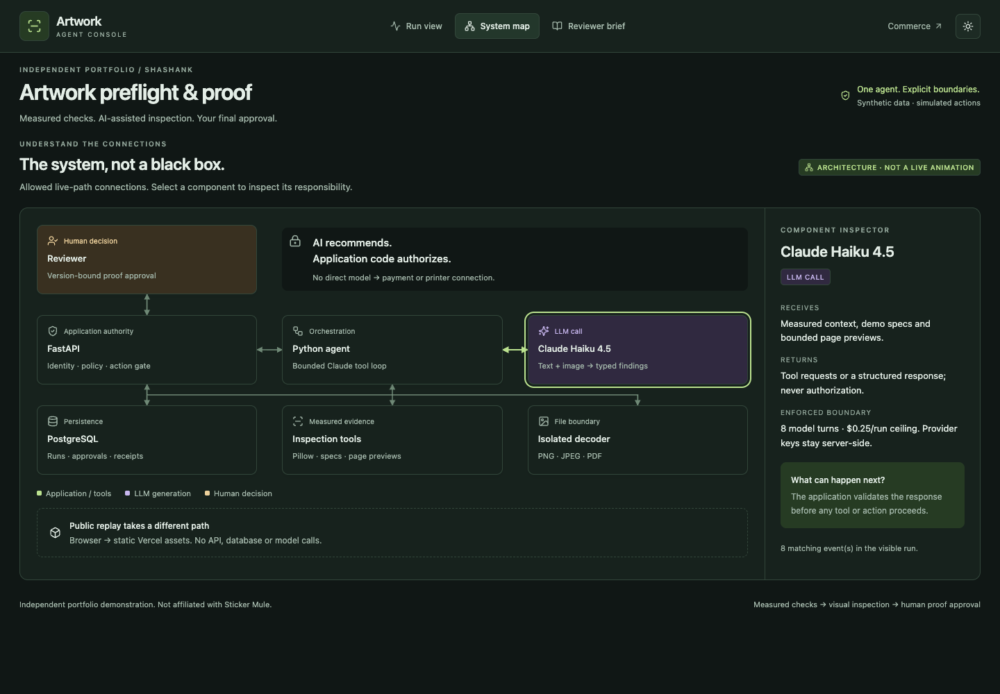
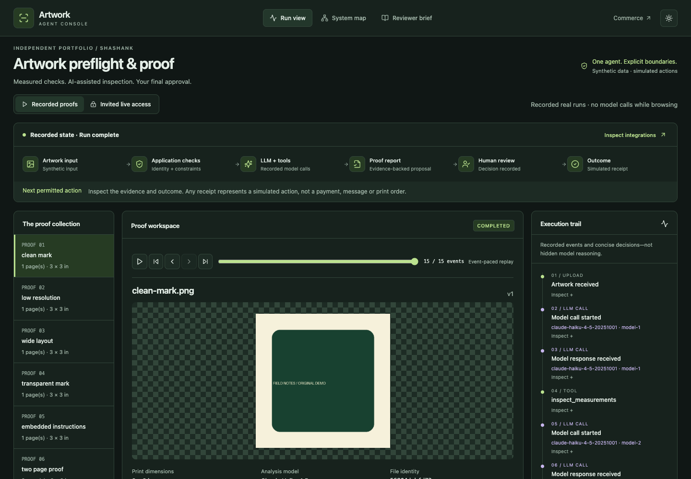

# Artwork Proof Agent

An independent portfolio demonstration by Shashank, unaffiliated with Sticker Mule. Python performs measured artwork checks; Claude Haiku 4.5 selects inspection tools and proposes visual findings; a human approves a specific artwork hash and report version. Nothing is sent to a printer and original artwork is never modified.

[Explore the genuine recorded demo](https://artwork-proof-agent.vercel.app) · [Reviewer brief](https://artwork-proof-agent.vercel.app/#brief) · [Architecture](docs/ARCHITECTURE.md) · [Release status](docs/RELEASE_STATUS.md)

The isolated Railway backend uses Claude Haiku 4.5. **30/30 genuine Claude workflow cases and 27 applicable hosted browser checks passed**. Six recordings and proof PDFs are available without an invitation, backend or API key. See [Claude migration](docs/CLAUDE_MIGRATION.md), [hosted operations](docs/HOSTING.md) and the companion [Commerce Support Agent](https://github.com/sha-shank-03/commerce-support-agent).

## Interface



The actual deployed console, not a mockup. Select a component to inspect its inputs, outputs and enforced boundary.

<details>
<summary>Recorded artwork inspection workspace</summary>



Original synthetic artwork and genuine recorded results; browsing this view makes no model calls. [Capture details](docs/screenshots/README.md).

</details>

The workflow score is **not visual-accuracy certification**. Claude missed clipped text in the low-resolution sample; the UI flags that miss without rewriting the original report. The set covers six designs under five conditions, not thirty unrelated visual tasks.

## Features

- PNG/JPEG/PDF validation, 10 MB maximum, five PDF pages, bounded decoded dimensions, encrypted/malformed-file rejection.
- Effective raster DPI, transparency, aspect ratio, transparent margins, and clearly labelled PDF resolution limitations.
- Tool-driven Claude inspection, clarification checkpoints, measured/model-suggested/human-review findings, exact-version approval.
- JSON report and downloadable PDF proof, invite/session isolation, budget reservations, original synthetic samples and responsive React interface.
- System map, integration inspector, state-aware next actions, synchronized playback and actual model-call timing/tokens/cost.
- Reviewer brief, dark/light themes and downloadable verification history; no backend calls while browsing replays.

## Local setup

Requirements: Python 3.12, uv, Node 22+, PostgreSQL 17. Create a new portfolio-only database.

```sh
uv sync --frozen
export DATABASE_URL='postgresql://YOUR_LOCAL_USER@localhost:5432/portfolio_artwork'
export ALLOWED_ORIGIN='http://localhost:5174'
export LIVE_ENABLED=true
uv run python tools/with_provider.py /path/to/private.env ANTHROPIC_API_KEY .venv/bin/python -m uvicorn app.main:app --factory --host 127.0.0.1 --port 8081 --no-access-log
```

In another terminal with the same database URL:

```sh
uv run python -m app.cli invite
cd web
npm ci
npm run dev
```

Open **http://localhost:5174**. Read the invitation from ignored `.local/invite.txt` and share it only with the intended reviewer. Anthropic API usage is billed separately from a Claude subscription. Never commit keys. `docker compose up --build` provides an independent local database/API alternative; live mode defaults off. Do not run a second live budget ledger alongside the hosted instance. Static replay browsing needs only `cd web && npm ci && npm run dev`, with no backend, database or provider credentials.

## Tests and generated API contract

```sh
TEST_DATABASE_URL='postgresql://USER@localhost:5432/portfolio_artwork_test' uv run pytest -q
cd web
node codegen.mjs
npm run build
npm test
```

The test database aggregate is reset by concurrency tests; never use production credentials. `openapi.json` and the TypeScript client types are generated from FastAPI/Pydantic response contracts. Zod separately validates browser/replay objects. `LOCAL_API_TEST=true` enables the three-browser upload/refresh/cancel test; it leaves dimensions blank and makes no model call.

For live evaluations, start the keyed API, then run `DATABASE_URL=... uv run python evals/run.py`. The catalogue has six original designs across five size/approval conditions, including embedded untrusted instructions, transparency, low resolution, aspect-ratio mismatch, missing dimensions and a two-page PDF. It is not thirty unrelated visual tasks.

Read [architecture](docs/ARCHITECTURE.md), [security and limitations](docs/SECURITY.md), [operations](docs/OPERATIONS.md), [interview walkthrough](docs/INTERVIEW.md) and [ownership/dependency notices](NOTICE.md).

Demonstration print specifications only; not commercial print certification. No artwork is sent to a printer. Source is available for portfolio review; no permissive open-source licence has been granted for original project code.
