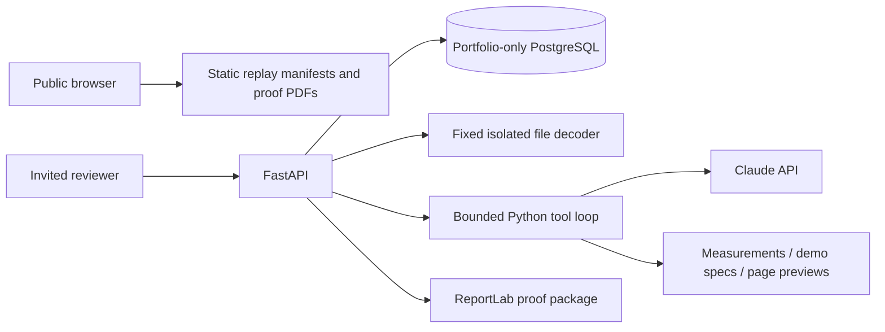

# Architecture and contracts

Raw upload bytes are checked by magic signature, size and declared MIME type, then sent on stdin to a fixed subprocess. It rejects unsupported/encrypted/malformed input and renders bounded previews. CPU/time limits apply; Linux adds an address-space limit. Only measured metadata, preview bytes, file hash and ownership are retained, not the original source file. Original fixtures are generated locally from project code.

The model must inspect measured data, demonstration specifications and every page before submitting its report. Tool arguments and final findings are validated. Code adds measured findings; model-provided findings can only be model-suggested or require human review and must cite an available preview. Native raster DPI is calculated from source pixels and requested inches. A PDF preview's pixel dimensions are never represented as embedded-raster print DPI.

The report digest includes artwork hash, report version, findings and specification version. Human approval verifies those fields and expiry; repeat approval returns the existing receipt. Uploading another design starts a distinct run with its own hash and approval. The first release does not edit artwork in place or reuse the old approval for a new run.

## State and persistence

Run states: queued, running, awaiting_input, awaiting_approval, completed, failed, cancelled. Tool results and model messages are persisted before pausing. A database lease prevents competing execution. A crashed/expired worker becomes explicitly recoverable. Provider retries are disabled; uncertain in-flight usage is charged conservatively before an explicit retry.

This low-volume prototype uses one PostgreSQL JSONB aggregate protected by `SELECT FOR UPDATE`, serializing budget and access changes. It is not a scalable multi-tenant SaaS data model. Storage is bounded by actual serialized runs/uploads including messages: 25 MB/reviewer, 128 MB globally. Run/upload/session expiry is checked on access and physical pruning occurs on successful transactions. Keep monthly budget history. For scale, normalize runs/assets/events, use object storage with lifecycle policies and add a durable queue.

## REST API

- `POST /session` exchanges an invitation for a secure HTTP-only session.
- `POST /uploads?name=...` accepts bounded raw PNG/JPEG/PDF bytes.
- `POST /runs` starts an analysis or pauses for missing dimensions.
- `GET /runs`, `GET /runs/{id}`, `GET /runs/{id}/events?after=N` return owned records/events.
- `POST /runs/{id}/clarify|approve|reject|cancel|resume` performs server-validated transitions.
- `GET /runs/{id}/report.json|proof.pdf` downloads owned reports.
- `/health` and `/ready` separate liveness from database readiness.

The generated OpenAPI contract and browser types are committed. Internal messages, reservation details and lease secrets are excluded from public responses. Public replay files must be explicitly exported from real, successful model runs and reviewed before publication.
